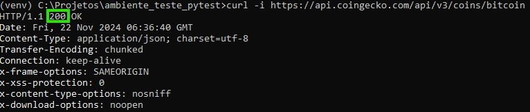
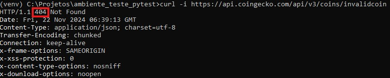

# 🧪 Testes Automatizados de APIs com Pytest

Este repositório contém scripts de testes automatizados para diversas APIs públicas, utilizando a biblioteca **Pytest**. Ele inclui exemplos de como estruturar testes, criar ambientes virtuais, e validar dados de APIs como **SpaceX**, **PokeAPI**, **Cat Facts**, e **CoinGecko**.

## 📋 Índice

1. [📜 Descrição Geral](#descrição-geral)
2. [🚀 Funcionalidades](#funcionalidades)
3. [📂 Estrutura de Diretórios](#estrutura-de-diretórios)
4. [⚙️ Pré-requisitos](#pré-requisitos)
5. [💻 Configuração do Ambiente](#configuração-do-ambiente)
6. [📜 Execução dos Testes](#execução-dos-testes)
7. [📝 Explicação dos Testes](#explicação-dos-testes)
8. [📚 Recursos](#recursos)

---

## 📜 Descrição Geral

Este projeto exemplifica o uso de **Pytest** para testar a funcionalidade de APIs públicas. Os testes incluem:

- Verificação de status HTTP.
- Validação de dados retornados.
- Análise da estrutura das respostas.
- Cobertura de cenários de erro.

---

## 🚀 Funcionalidades

✅ Testes para 4 APIs populares:

- **SpaceX API**: Últimos lançamentos espaciais.
- **PokeAPI**: Informações sobre Pokémon.
- **Cat Facts API**: Curiosidades sobre gatos.
- **CoinGecko API**: Dados sobre criptomoedas.

✅ Cobertura de 5 cenários principais para cada API:

1. Resposta de sucesso (200).
2. Cenário de erro (404).
3. Validação de dados retornados.
4. Estrutura esperada das respostas.
5. Verificação de listas ou históricos.

---





## 📂 Estrutura de Diretórios

Abaixo está a estrutura do projeto:

```plaintext
📦 Projeto
├── 📁 tests
│   ├── 📝 test_spacex_api.py
│   ├── 📝 test_pokeapi.py
│   ├── 📝 test_cat_facts_api.py
│   ├── 📝 test_coin_gecko_api.py
├── 📄 requirements.txt
├── 📄 README.md
Arquivos Principais
Arquivo	Descrição
test_spacex_api.py	Testes automatizados para a SpaceX API.
test_pokeapi.py	Testes automatizados para a PokeAPI.
test_cat_facts_api.py	Testes automatizados para a Cat Facts API.
test_coin_gecko_api.py	Testes automatizados para a CoinGecko API.
requirements.txt	Dependências necessárias para rodar o projeto.
README.md	Documentação detalhada do projeto.
⚙️ Pré-requisitos
Certifique-se de ter os seguintes componentes instalados:

Python 3.8+ 🐍
Pip (gerenciador de pacotes do Python)
Git (opcional, para clonar o repositório)
💻 Configuração do Ambiente
Siga as etapas abaixo para configurar o ambiente e executar os testes:

1️⃣ Clonar o Repositório
bash
git clone https://github.com/seu-usuario/testes-apis.git
cd testes-apis
2️⃣ Criar um Ambiente Virtual
bash
python -m venv venv
source venv/bin/activate  # Linux/Mac
venv\Scripts\activate     # Windows

Crie o arquivo requirements.txt com as dependências:

plaintext
pytest
requests

Instale o virtualenv para criar ambientes isolados:
bash
pip install virtualenv

3️⃣ Instalar Dependências
bash
pip install -r requirements.txt
pip install responses

4️⃣ Execução dos Testes
Para executar todos os testes:
bash
pytest tests/

Para rodar testes específicos:
bash
pytest tests/test_spacex_api.py

Para obter um relatório detalhado:
bash
pytest --html=report.html

Para exibir o histórico detalhado dos testes ao rodar o pytest no CMD, você pode usar o seguinte comando:
bash
pytest -v --tb=short

-v: Ativa o modo verbose, que mostra detalhes de cada teste, como o nome e o resultado.
--tb=short: Configura o traceback para ser curto, mostrando apenas o essencial em caso de falha. Você pode substituir por:
--tb=long: Exibe detalhes completos do erro.
--tb=line: Mostra o erro em uma única linha.
--tb=no: Não exibe traceback.

Para salvar o histórico em um arquivo:
Use o operador > para redirecionar o resultado para um arquivo de texto:
bash
pytest -v > resultado_teste.txt

Saída Esperada
✅ Todos os testes aprovados: saída com fundo verde.
❌ Testes falhos: detalhes sobre as falhas.
📝 Explicação dos Testes
Os scripts de testes validam:

SpaceX API
Cenário	Descrição
✅ Resposta de Sucesso	Verifica se a API retorna status 200.
❌ Lançamento Inválido	Testa se a API retorna 404 para dados inexistentes.
📦 Estrutura dos Dados	Garante a presença das chaves esperadas.
PokeAPI
Cenário	Descrição
✅ Resposta de Sucesso	Testa se a API retorna status 200 para um Pokémon válido.
❌ Pokémon Inválido	Valida a resposta 404 para Pokémon inexistente.
📦 Dados de Pokémon	Verifica se name, id e types estão corretos.
Cat Facts API
Cenário	Descrição
✅ Resposta de Sucesso	Confirma que a API retorna fatos com status 200.
📦 Fato Não Vazio	Garante que o fato retornado não está vazio.
CoinGecko API
Cenário	Descrição
✅ Resposta de Sucesso	Testa a API para dados de Bitcoin.
📈 Histórico de Preços	Verifica se os preços históricos estão disponíveis.
📚 Recursos
Pytest Documentation: pytest.org
Requests Library: requests.readthedocs.io
APIs Usadas:
SpaceX: api.spacexdata.com
PokeAPI: pokeapi.co
Cat Facts: catfact.ninja
CoinGecko: coingecko.com

🌟 Dúvidas ou Sugestões?

Entre em contato via AlessandroWindsonMM@gmail.com

5️⃣ Conclusão
Esta documentação cobre os principais passos para criar, organizar e executar testes automatizados para APIs públicas. Certifique-se de personalizar os testes de acordo com suas necessidades e mantenha as dependências sempre atualizadas!
